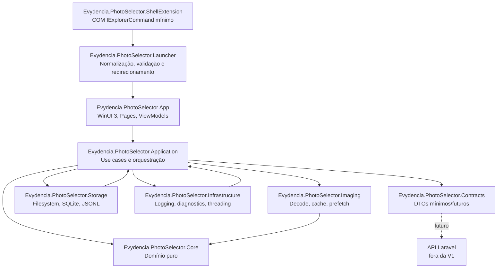

# Evydência Escolher Fotos - Plano técnico de implementação

Data do plano: 2026-05-03

## 1. Visão geral

O **Evydência Escolher Fotos** será um aplicativo Windows nativo, local-first e offline para seleção de fotos por exclusão. A V1 deve substituir a experiência web atual apenas no ponto crítico do fluxo do estúdio: abrir uma pasta local de JPEGs, mostrar a foto em tela cheia com alta qualidade, navegar com teclado e remover rapidamente as imagens que o cliente não quer.

O produto não deve se comportar como um visualizador genérico de fotos. A decisão central da V1 é otimizar o fluxo real do cliente no estúdio:

- abrir uma pasta de sessão pelo Windows Explorer;
- entrar direto em um visualizador limpo;
- navegar com seta direita/esquerda e espaço;
- apagar com Delete;
- desfazer com Ctrl+Z;
- manter contadores discretos da sessão;
- preservar rastreabilidade local por journal e logs;
- preparar a arquitetura para pedido, cliente, pacote, venda e segunda tela, sem implementar essas integrações na V1.

Fora do escopo da V1:

- API Laravel;
- login;
- PDV;
- venda, pedido ou financeiro;
- upload;
- RAW;
- IA;
- sincronização remota;
- viewer baseado em Electron ou WebView.

### 1.1 Revisão técnica de 2026-05-03

Após revalidar documentação oficial e pontos de risco, o plano foi ajustado com as seguintes melhorias obrigatórias antes da implementação:

1. validar .NET 10 LTS + Windows App SDK 2.0.1 como stack recomendada para produto novo, mantendo .NET 8 + WASDK 1.8 como fallback;
2. implementar single-instance e redirecionamento de ativação por `AppInstance`;
3. separar o menu de contexto em modos de desenvolvimento, produto interno e produto profissional;
4. criar `Evydencia.PhotoSelector.Launcher` para isolar ativação Shell do app pesado;
5. tornar o scan progressivo com `Directory.EnumerateFiles`;
6. calcular decode por `DisplayContext`, DPI, EXIF orientation, `fit contain` e margem de qualidade;
7. evitar preview fullscreen recomprimido em JPEG 88-92;
8. usar cache de memória dinâmico baseado em RAM disponível;
9. adotar `PendingDelete`, `PendingRestore` e `DeleteFailed`;
10. definir filesystem + journal como fonte da verdade, com SQLite derivado;
11. exigir `FileShare.ReadWrite | FileShare.Delete` em leituras de JPEG;
12. adicionar benchmarks automatizados e medição de memória;
13. formalizar modo rápido sRGB e modo futuro de cor precisa/ICC;
14. preparar `DisplayContext` para DPI, fullscreen e segunda tela.

### 1.2 Refinamento estrutural antes da implementação

Revisão adicional de arquitetura: o plano deve evitar que a V1 fique profissional no papel, mas pesada na prática. As melhorias estruturais obrigatórias antes do scaffold do app são:

1. adicionar `Evydencia.PhotoSelector.Application` para orquestrar casos de uso e impedir ViewModels gigantes;
2. manter `Core` como domínio puro, sem scanner concreto de filesystem;
3. mover acesso real a disco para `Storage/Filesystem`;
4. simplificar `ShellExtension` e `Launcher`, sem criar `Evydencia.PhotoSelector.Shell` na V1 enquanto não houver código compartilhado real;
5. adicionar governança de build na raiz: `global.json`, `Directory.Build.props`, `Directory.Build.targets`, `Directory.Packages.props`, `NuGet.config`, `.editorconfig`, `.gitignore`, `README.md` e `CHANGELOG.md`;
6. separar `packaging`, `fixtures`, `artifacts` e documentação;
7. criar `Application.Tests`, porque os fluxos reais ficam nos use cases;
8. separar benchmarks de microcenários e smokes de performance do app real;
9. não criar contratos futuros vagos cedo demais;
10. reordenar o roadmap para validar uma fatia vertical mínima com performance básica antes de expandir cache, shell e UX.

### 1.3 Atualizacao apos analise aprofundada dos repositorios em `C:\Users\Usuario\Desktop\ideias`

Foram analisados FlyPhotos, ImageGlass, qimgv, Oculante, JPEGView, QuickRawPicker, Win2D e WindowsAppSDK-Samples apenas como referencia conceitual. Nada deve ser copiado sem revisao de licenca. As melhorias que realmente entram no plano sao:

1. criar fila de decode com prioridade, coalescing por chave e cancelamento/limpeza agressiva de trabalho obsoleto;
2. introduzir "navigation burst mode": enquanto o cliente segura seta, priorizar preview/resposta visual e adiar refinamento pesado ate `KeyUp` ou pequeno periodo de idle;
3. combinar LRU com `TrimToWindow(activeWindowKeys)` no cache em memoria, porque o viewer tem janela previsivel de atual/proximas/anteriores;
4. adicionar politica de admissao de cache para JPEGs muito grandes, sem impedir decode da foto atual;
5. criar guard contra EXIF orientation dupla entre `DecodeTargetCalculator` e WIC/WinRT `ExifOrientationMode.RespectExifOrientation`;
6. formalizar taxonomia de erros de decode e file move para overlay, logs, testes e journal;
7. adicionar `JpegSignatureProbe` barato no caminho de decode, sem varrer todos os arquivos no scan inicial;
8. modelar atalhos como `ViewerCommand` + `KeyboardShortcutMap`, distinguindo comandos repetiveis de comandos de borda;
9. enriquecer `FileMoveService` com resultado detalhado, destino final, colisao, timestamps preservados e rollback quando possivel;
10. planejar SQLite/disk cache com prepared statements, purge em lote e sem varredura completa no startup critico;
11. manter `SessionFolderWatcher` e ordem atual do Explorer como opcionais futuros, nao como requisito da V1.

## 2. Referências avaliadas

### 2.1 Repositórios locais em `repositorios`

Foram avaliados os repositórios locais disponíveis em `C:\Users\Usuario\Desktop\visualizador\repositorios`:

- `WindowsAppSDK-main`: base para Windows App SDK, WinUI 3, empacotamento e integração com recursos modernos do Windows.
- `microsoft-ui-xaml-main`: referência de WinUI 3, Fluent Design, controles, estilos, layout e requisitos de Windows.
- `Win2D-winappsdk-main`: referência para renderização 2D acelerada por GPU, futura evolução para zoom, pan e escala premium.
- `metadata-extractor-dotnet-main`: referência para leitura de metadados JPEG, especialmente EXIF orientation e data de captura.
- `serilog-dev`: referência para logging estruturado, sinks, JSON e fechamento correto dos logs.
- `Windows-main`: Windows Community Toolkit, útil para helpers e controles WinUI, mas deve ser usado com parcimônia.
- `SkiaSharp-main`: avaliado como alternativa de renderização, mas não recomendado como stack primária porque o direcionamento do produto é Windows nativo com WIC/Win2D.

Os repositórios `riyasy/FlyPhotos`, `woelper/oculante`, `sylikc/jpegview` e `d2phap/ImageGlass` não estavam presentes localmente no momento desta análise. Eles devem ser tratados como referências externas de UX, performance e filosofia de viewer, sem cópia de código sem análise formal de licença.

### 2.2 Documentações oficiais consultadas

Referências principais:

- Windows App SDK: https://learn.microsoft.com/windows/apps/windows-app-sdk/
- WinUI 3: https://learn.microsoft.com/windows/apps/winui/winui3/
- Empacotamento Windows apps: https://learn.microsoft.com/windows/apps/package-and-deploy/
- Integração de apps empacotados com File Explorer: https://learn.microsoft.com/windows/apps/desktop/modernize/integrate-packaged-app-with-file-explorer
- Manifesto `desktop5:ItemType`: https://learn.microsoft.com/uwp/schemas/appxpackage/uapmanifestschema/element-desktop5-itemtype
- `IExplorerCommand`: https://learn.microsoft.com/windows/win32/api/shobjidl_core/nn-shobjidl_core-iexplorercommand
- Windows Imaging Component: https://learn.microsoft.com/windows/win32/wic/-wic-about-windows-imaging-codec
- Win2D: https://learn.microsoft.com/windows/apps/develop/win2d/
- `BitmapImage.DecodePixelWidth`: https://learn.microsoft.com/uwp/api/windows.ui.xaml.media.imaging.bitmapimage.decodepixelwidth
- Microsoft.Data.Sqlite: https://learn.microsoft.com/dotnet/standard/data/sqlite/
- Serilog: https://serilog.net/
- MetadataExtractor: https://github.com/drewnoakes/metadata-extractor-dotnet
- Photo Mechanic / Camera Bits docs: https://docs.camerabits.com/
- .NET lifecycle e suporte: https://learn.microsoft.com/lifecycle/products/microsoft-net-and-net-core
- .NET releases e suporte: https://learn.microsoft.com/dotnet/core/releases-and-support
- NuGet `Microsoft.WindowsAppSDK 2.0.1`: https://www.nuget.org/packages/Microsoft.WindowsAppSDK/2.0.1
- AppLifecycle single-instance: https://learn.microsoft.com/windows/apps/windows-app-sdk/applifecycle/applifecycle-single-instance
- AppLifecycle migration: https://learn.microsoft.com/windows/apps/windows-app-sdk/migrate-to-windows-app-sdk/guides/applifecycle
- Package identity/external location: https://learn.microsoft.com/windows/apps/desktop/modernize/grant-identity-to-nonpackaged-apps-overview
- `Directory.EnumerateFiles`: https://learn.microsoft.com/dotnet/api/system.io.directory.enumeratefiles
- `FileShare` e `FileOptions`: https://learn.microsoft.com/dotnet/api/system.io.fileshare e https://learn.microsoft.com/dotnet/api/system.io.fileoptions
- WIC color management: https://learn.microsoft.com/windows/win32/wic/-wic-colormanagement
- WinUI 3 múltiplas janelas e AppWindow: https://learn.microsoft.com/windows/apps/develop/ui-input/multiple-windows
- BenchmarkDotNet: https://benchmarkdotnet.org/
- `global.json`: https://learn.microsoft.com/dotnet/core/tools/global-json
- Central Package Management / `Directory.Packages.props`: https://learn.microsoft.com/nuget/consume-packages/central-package-management
- `Directory.Build.props` e `Directory.Build.targets`: https://learn.microsoft.com/visualstudio/msbuild/customize-by-directory
- `dotnet format`: https://learn.microsoft.com/dotnet/core/tools/dotnet-format
- `dotnet test`: https://learn.microsoft.com/dotnet/core/tools/dotnet-test
- MSIX overview: https://learn.microsoft.com/windows/msix/overview

## 3. Decisões técnicas

| Área | Decisão | Justificativa | Fase |
| --- | --- | --- | --- |
| UI | WinUI 3 com Windows App SDK | Stack nativa moderna, boa integração com Windows 10/11, AppWindow, MSIX, Fluent e C# | V1 |
| Linguagem | C#/.NET | Produtividade, ecossistema Windows, DI, testes, bibliotecas maduras | V1 |
| Application layer | Criar `Evydencia.PhotoSelector.Application` | Orquestra casos de uso, evita ViewModels gordos e mantém `Core` puro | V1 |
| Target inicial | Validar Opção A: .NET 8 + Windows App SDK 1.8; e Opção B: .NET 10 LTS + Windows App SDK 2.0.1 | .NET 10 tem janela de suporte até novembro de 2028; .NET 8 e .NET 9 encerram em novembro de 2026. Para produto novo em 2026, usar .NET 10 + WASDK 2.0.1 se WinUI/VS/MSIX estiverem estáveis no ambiente | Fase 0 |
| Renderização V1 | WIC/WinUI `Image` com decode no tamanho da tela | Entrega rápida e simples, reduz uso de memória, suficiente para fullscreen contain | V1 |
| Renderização V1.5/V2 | Win2D/Direct2D atrás de abstração | Melhor controle de escala, zoom, pan, interpolação, canvas e refinamento visual | V1.5/V2 |
| EXIF | MetadataExtractor como fonte de metadados | Lê EXIF orientation, dimensões e data de captura de JPEG de forma independente do viewer | V1 |
| Estado local | Sistema de arquivos + JSONL como fonte da verdade; SQLite como índice derivado | O operador pode mexer nos arquivos fora do app; o replay deve reconciliar pasta original, `_deletadas_evydencia` e journal | V1 |
| Logs | Serilog com arquivo local estruturado | Diagnóstico de performance, erro de arquivo, decode, cache e shell activation | V1 |
| Cache | LRU em memória dinâmico + thumbnails em disco + preview persistente opcional de alta qualidade | Evita recompressão perceptível no fullscreen e respeita RAM disponível | V1 |
| Exclusão padrão | Mover para `_deletadas_evydencia` dentro da pasta da sessão | Undo determinístico, baixa chance de perda irreversível, recuperação visível ao operador | V1 |
| Lixeira | Modo opcional após validação técnica | A Lixeira é boa para segurança, mas o restore controlado pelo app é menos determinístico | V1.5 |
| Exclusão permanente | Modo avançado protegido | Somente para operação consciente; não deve ser padrão | Futuro |
| Menu de contexto | MSIX + extensão File Explorer + COM `IExplorerCommand`; registro clássico apenas fallback | Necessário para o menu moderno do Windows 11 e instalação profissional | V1 |
| Instância do app | Single-instance com redirecionamento de ativação por `AppInstance` | WinUI/Windows App SDK é multi-instance por padrão; evita múltiplas janelas ao clicar várias vezes no Explorer | V1 |
| Scanner | `Directory.EnumerateFiles` progressivo, nunca `Directory.GetFiles` no caminho crítico | Permite começar a listar antes de carregar todo o array de arquivos | V1 |
| Scanner concreto | `FileSystemFolderScanner` em `Storage`, contrato em `Application` e política em `Core` | Evita contaminar o domínio com filesystem concreto | V1 |
| Display/DPI | `DisplayContext` obrigatório desde a V1 | Decode, fullscreen e segunda tela dependem de monitor, DPI, área útil e escala de rasterização | V1 |
| Benchmarks | Projeto dedicado com BenchmarkDotNet e smoke de performance | Performance vira contrato de produto, não impressão subjetiva | V1 |
| Build governance | `global.json`, `Directory.Build.props`, `Directory.Packages.props`, `.editorconfig` e scripts fixos | Garante SDK, propriedades MSBuild, versões NuGet e formatação consistentes | Fase 1 |
| Packaging | Pasta `/packaging` para MSIX, manifest fragments, contexto e certificados dev | Mantém empacotamento fora de `src` e prepara package identity | Fase 4 |
| API futura | `Contracts` mínimos na V1; interfaces remotas somente na Fase 6 | Mantém separação sem criar código futuro vazio ou incentivar HTTP prematuro | V1/Fase 6 |
| Segunda tela futura | Coordenador de sessão + múltiplas janelas | Permite CustomerDisplayWindow e OperatorWindow sem reescrever o core | V2 |

### 3.1 Política de versão da stack

A Fase 0 deve validar duas combinações antes de iniciar a implementação principal:

| Opção | Stack | Uso no plano |
| --- | --- | --- |
| A - conservadora | .NET 8 + Windows App SDK 1.8 | Fallback técnico se o ambiente atual de Visual Studio, WinUI, MSIX, shell extension ou dependências não estiver pronto para .NET 10/WASDK 2 |
| B - recomendada para produto novo | .NET 10 LTS + Windows App SDK 2.0.1 | Caminho preferencial para um app novo em 2026, desde que compile, empacote, rode e suporte o pipeline WinUI/Shell no ambiente do estúdio |

Observação de validação em 2026-05-03: o NuGet oficial já lista `Microsoft.WindowsAppSDK 2.0.1`, publicado em 2026-04-29, enquanto algumas páginas do Microsoft Learn de downloads/release notes ainda podem aparecer defasadas ou inconsistentes. Por isso a decisão final não deve ser tomada só por intenção de versão: deve existir prova local de build, execução, MSIX, `IExplorerCommand`, single-instance e smoke de fullscreen.

Regra de decisão:

- se a Opção B compilar, empacotar e passar nos protótipos da Fase 0, ela vira o baseline da V1;
- se a Opção B falhar por bloqueio real de toolchain, registrar o motivo no ADR e usar Opção A temporariamente;
- não usar .NET 9 como alvo principal, pois sua janela de suporte termina junto de .NET 8 em novembro de 2026;
- travar versões em `Directory.Packages.props` e registrar atualizações por ADR.

### 3.2 Governança da solução

Arquivos obrigatórios na raiz antes do scaffold completo:

```text
/
  Evydencia.PhotoSelector.sln
  global.json
  Directory.Build.props
  Directory.Build.targets
  Directory.Packages.props
  NuGet.config
  .editorconfig
  .gitignore
  AGENTS.md
  PLANS.md
  README.md
  CHANGELOG.md
```

Regras:

- `global.json` fixa o SDK .NET validado pela Fase 0;
- `Directory.Build.props` define propriedades comuns: nullable, implicit usings, analyzers, determinismo, warning level e `TreatWarningsAsErrors` onde fizer sentido;
- `Directory.Build.targets` fica reservado para validações comuns e hooks de build que não pertençam aos `.csproj`;
- `Directory.Packages.props` centraliza versões NuGet com Central Package Management;
- `NuGet.config` deve declarar fontes de pacote de forma explícita;
- `.editorconfig` é a fonte de estilo e análise para IDE e `dotnet format`;
- `/artifacts` deve ser ignorado no Git, exceto documentação ou `.gitkeep` se necessário.

## 4. Princípios de arquitetura

1. **Local-first real**: o app deve funcionar sem internet, sem login e sem API.
2. **UI sempre responsiva**: scan, metadata, decode, cache e move de arquivo nunca devem bloquear a thread de UI.
3. **Viewer especializado**: o centro do produto é escolher por exclusão, não organizar biblioteca de fotos.
4. **Separação forte de domínio**: navegação, contadores, exclusão e undo devem ser testáveis sem WinUI.
5. **Renderização substituível**: a V1 pode usar WinUI/WIC; Win2D deve entrar sem quebrar `Core`.
6. **Auditoria local**: toda exclusão/restauração relevante deve ser registrada em journal append-only.
7. **Baixo risco operacional**: Delete não deve significar perda permanente por padrão.
8. **Preparação sem acoplamento**: API, pedido, pacote e segunda tela entram por contratos, não por dependências escondidas no viewer.

## 5. Arquitetura em camadas



Regras de dependência:

- `Core` não referencia WinUI, Storage, Imaging, Shell, Serilog, SQLite, filesystem concreto ou HTTP.
- `Application` contém casos de uso e orquestra interfaces implementadas por Storage, Imaging e Infrastructure.
- `Application` não referencia WinUI e não deve conter detalhes de XAML, `Window`, `Page` ou controles.
- `Imaging` referencia modelos/contratos necessários, mas não decide navegação nem exclusão.
- `Storage` implementa filesystem, journal, SQLite e cache em disco, mas não executa regras de domínio.
- `App` faz composição, UI, binding, atalhos, fullscreen e adaptação WinUI.
- `ShellExtension` deve ser o menor possível: obter a seleção do Explorer e chamar o launcher.
- `Launcher` recebe caminho/URI, normaliza, valida pasta e encaminha para a instância principal; não faz scan, decode, journal nem cache.
- `Contracts` não deve conter cliente HTTP real na V1 e deve começar mínimo.

### 5.1 Camada Application

`Evydencia.PhotoSelector.Application` é a camada de casos de uso. Ela evita que `FullscreenViewerViewModel` vire o centro operacional do produto.

Casos de uso esperados:

```text
OpenSessionUseCase
NavigateNextPhotoUseCase
NavigatePreviousPhotoUseCase
DeleteCurrentPhotoUseCase
UndoLastDeleteUseCase
RecoverSessionUseCase
BuildLocalSelectionSummaryUseCase
PrepareViewerImageUseCase
```

Abstrações esperadas:

```text
IFolderScanner
IFileMoveService
ISessionJournalStore
IImagePreviewService
ISettingsStore
IPerformanceMeter
IPhotoMetadataReader
```

Regra: interfaces que representam IO, imagem, journal, settings e performance pertencem a `Application/Abstractions`, não ao `Core`.

## 6. Estrutura de solução proposta

```text
/ 
  Evydencia.PhotoSelector.sln
  global.json
  Directory.Build.props
  Directory.Build.targets
  Directory.Packages.props
  NuGet.config
  .editorconfig
  .gitignore
  AGENTS.md
  PLANS.md
  README.md
  CHANGELOG.md

/src
  /Evydencia.PhotoSelector.App
    App.xaml
    MainWindow.xaml
    Activation/
      AppActivationService.cs
      AppInstanceCoordinator.cs
      CommandLineFolderOpenRequestParser.cs
      ActivationRedirectHandler.cs
    Pages/
      HomePage.xaml
      FullscreenViewerPage.xaml
      SettingsPage.xaml
    Views/
      ViewerOverlay.xaml
      EmptySessionView.xaml
      ErrorOverlay.xaml
    ViewModels/
      HomeViewModel.cs
      FullscreenViewerViewModel.cs
      SettingsViewModel.cs
    Input/
      KeyboardShortcutService.cs
      ShortcutMap.cs
    Windowing/
      FullscreenService.cs
      AppWindowService.cs
      DisplayContextService.cs
    Display/
      WindowsDisplayContextService.cs
      MonitorRole.cs
    Composition/
      AppCompositionRoot.cs
    Resources/
    Assets/

  /Evydencia.PhotoSelector.Application
    UseCases/
      OpenSessionUseCase.cs
      NavigateNextPhotoUseCase.cs
      NavigatePreviousPhotoUseCase.cs
      DeleteCurrentPhotoUseCase.cs
      UndoLastDeleteUseCase.cs
      RecoverSessionUseCase.cs
      BuildLocalSelectionSummaryUseCase.cs
      PrepareViewerImageUseCase.cs
    Abstractions/
      IFolderScanner.cs
      IFileMoveService.cs
      ISessionJournalStore.cs
      IImagePreviewService.cs
      ISettingsStore.cs
      IPerformanceMeter.cs
      IPhotoMetadataReader.cs
    Models/
      OpenSessionCommand.cs
      OpenSessionResult.cs
      DeletePhotoCommand.cs
      DeletePhotoResult.cs
      DisplayContextSnapshot.cs

  /Evydencia.PhotoSelector.Launcher
    Program.cs
    ShellLaunchRequest.cs
    ShellLaunchRequestParser.cs
    PathNormalizationService.cs
    MainInstanceForwarder.cs

  /Evydencia.PhotoSelector.Core
    Sessions/
      PhotoSession.cs
      PhotoSessionFactory.cs
      SessionState.cs
      FolderOpenRequest.cs
    Photos/
      PhotoItem.cs
      PhotoStatus.cs
      PhotoSortMode.cs
    Navigation/
      NavigationController.cs
      NavigationResult.cs
    Deletion/
      DeleteManager.cs
      UndoManager.cs
      DeletedPhotoEvent.cs
      DeleteMode.cs
    Scanning/
      FolderScanPolicy.cs
      PhotoFileCandidate.cs
      FolderScanResult.cs
    Recovery/
      SessionReconciler.cs
    Events/
      SessionDomainEvent.cs
    Policies/
      DeleteStatePolicy.cs
      IClock.cs

  /Evydencia.PhotoSelector.Imaging
    Decode/
      JpegDecodeService.cs
      WicImageLoader.cs
      JpegSignatureProbe.cs
      ImageDecodeErrorCode.cs
      ImageDecodeRequest.cs
      ImageDecodeResult.cs
    Metadata/
      ExifOrientationReader.cs
      IccProfileProbe.cs
    Sizing/
      DecodeTargetCalculator.cs
      FitContainCalculator.cs
    Cache/
      PreviewCacheService.cs
      ThumbnailCacheService.cs
      MemoryImageCache.cs
      ImageCacheKey.cs
      ImageCachePolicy.cs
      CachePathProvider.cs
    Prefetch/
      PrefetchScheduler.cs
      PrefetchPlan.cs
      DecodePriorityQueue.cs
      ViewerDecodeWorkQueue.cs
    Rendering/
      IImageRenderer.cs
      WinUiImageRenderer.cs
      Win2DRenderer.cs

  /Evydencia.PhotoSelector.Storage
    Filesystem/
      FileSystemFolderScanner.cs
      FileMoveService.cs
      FileMoveResult.cs
      FileOperationErrorCode.cs
      FileSystemPathService.cs
      FileCollisionPolicy.cs
      RecycleBinFileDeleteService.cs
    Journal/
      JsonlSessionJournalStore.cs
      JournalReplayService.cs
    Settings/
      AppSettings.cs
      AppSettingsService.cs
      SettingsStore.cs
    RecentSessions/
      RecentSessionsService.cs
    Sqlite/
      SqliteConnectionFactory.cs
      SqliteSchemaMigrator.cs
      SqliteSessionIndexStore.cs
      SqliteCacheIndexStore.cs
    Cache/
      DiskCacheStore.cs
      CacheCleanupService.cs

  /Evydencia.PhotoSelector.Infrastructure
    DependencyInjection/
      ServiceCollectionExtensions.cs
    Logging/
      SerilogBootstrapper.cs
      LogEventNames.cs
    Diagnostics/
      PerformanceMeter.cs
      AppDiagnostics.cs
      UiThreadGuard.cs
    Threading/
      CancellationCoordinator.cs
      BackgroundTaskQueue.cs
    Errors/
      GlobalExceptionHandler.cs

  /Evydencia.PhotoSelector.ShellExtension
    Native C++/WinRT or C++ COM project
    ExplorerCommand.cpp
    ExplorerCommand.h
    PackageManifest fragments

  /Evydencia.PhotoSelector.Contracts
    LocalSelectionSummary.cs
    DeletedPhotoEventDto.cs

/tests
  /Evydencia.PhotoSelector.Core.Tests
    NavigationControllerTests.cs
    DeleteWorkflowTests.cs
    PhotoSessionFactoryTests.cs

  /Evydencia.PhotoSelector.Application.Tests
    OpenSessionUseCaseTests.cs
    DeleteCurrentPhotoUseCaseTests.cs
    UndoLastDeleteUseCaseTests.cs
    RecoverSessionUseCaseTests.cs

  /Evydencia.PhotoSelector.Imaging.Tests
    ExifOrientationReaderTests.cs
    DecodeTargetCalculatorTests.cs
    MemoryImageCacheTests.cs
    PreviewCacheServiceTests.cs
    CacheKeyTests.cs

  /Evydencia.PhotoSelector.Storage.Tests
    SessionJournalStoreTests.cs
    FileMoveServiceTests.cs
    RecentSessionsServiceTests.cs

  /Evydencia.PhotoSelector.IntegrationTests
    TempFolderDeleteTests.cs
    UndoRestoreTests.cs
    JournalReplayTests.cs
    LargeFolderSmokeTests.cs

  /Evydencia.PhotoSelector.UiSmokeTests
    ExplorerActivationSmokeTests.cs
    FullscreenSmokeTests.cs
    KeyboardShortcutSmokeTests.cs

  /fixtures
    /jpeg
      /orientation
      /large
      /small

/benchmarks
  /Evydencia.PhotoSelector.Benchmarks
    Micro/
      DecodeTargetCalculatorBenchmarks.cs
      CacheKeyBenchmarks.cs
      JournalReplayBenchmarks.cs
      MemoryCacheBenchmarks.cs
    IO/
      FolderScanBenchmarks.cs
      FileMoveBenchmarks.cs
      DeleteUndoBenchmarks.cs

/performance-smoke
  AppStartupSmoke/
  FirstImageSmoke/
  HoldRightArrowSmoke/
  FullscreenSmoke/

/packaging
  /msix
  /certificates-dev
  /manifest-fragments
  /context-menu

/tools
  build.ps1
  test.ps1
  format.ps1
  benchmarks.ps1
  package-msix.ps1
  install-context-menu-dev.ps1
  uninstall-context-menu-dev.ps1
  generate-test-jpegs.ps1

/docs
  /adr
    0001-stack-version.md
    0002-delete-mode.md
    0003-context-menu.md
    0004-source-of-truth.md
    0005-image-pipeline.md
    0006-build-and-packaging.md
  evydencia-escolher-fotos-plano-implementacao.md
  architecture.md
  image-pipeline.md
  performance-plan.md
  context-menu.md
  second-screen-future.md
  release-checklist.md
  api-future-integration.md

/artifacts
  /performance
  /logs
  /packages
```

Notas de organização:

- `Evydencia.PhotoSelector.Shell` não deve ser criado na V1 se não houver código compartilhado real entre ShellExtension e Launcher.
- `FolderScanner` concreto não fica em `Core`; o domínio fica com política, candidato e resultado.
- `DecodeTargetCalculator` deve ser classe testável e isolada.
- `FutureOrderContext`, `IRemoteOrderService` e contratos remotos entram apenas na Fase 6 se ainda forem necessários.
- `/artifacts` deve ser ignorado pelo Git para evitar benchmark, pacotes e logs versionados por acidente.

## 7. Modelo conceitual

### 7.1 `PhotoItem`

Responsabilidade: representar uma imagem JPEG dentro da sessão local.

Campos:

- `Id`
- `FileName`
- `FullPath`
- `OriginalDirectory`
- `Extension`
- `SizeBytes`
- `LastWriteTimeUtc`
- `Width`
- `Height`
- `ExifOrientation`
- `CaptureDate`
- `Status`: `Active`, `PendingDelete`, `Deleted`, `PendingRestore`, `Restored`, `Missing`, `DeleteFailed`
- `PreviewCachePath`
- `ThumbnailCachePath`
- `SortIndex`

Observações:

- `SortIndex` deve preservar a posição original para undo.
- `FullPath + LastWriteTimeUtc + SizeBytes` compõe a identidade de cache.
- `CaptureDate` pode ser nulo na V1; ordenação por EXIF fica para fase futura.
- `PendingDelete` e `PendingRestore` são estados obrigatórios para manter resposta visual imediata sem corromper a sessão quando o sistema de arquivos falhar.

### 7.2 `PhotoSession`

Responsabilidade: estado de uma sessão aberta pelo operador.

Campos:

- `Id`
- `FolderPath`
- `StartedAt`
- `LastOpenedAt`
- `InitialCount`
- `ActiveCount`
- `DeletedCount`
- `CurrentIndex`
- `SettingsSnapshot`
- `JournalPath`
- `Items`

Invariantes:

- `ActiveCount + DeletedCount + MissingCount` deve bater com a lista conhecida.
- `CurrentIndex` nunca deve apontar para item deletado.
- A pasta `_deletadas_evydencia` nunca entra na listagem ativa.

### 7.3 `DeletedPhotoEvent`

Responsabilidade: registrar evento de exclusão/restauração.

Campos:

- `EventId`
- `SessionId`
- `PhotoId`
- `FileName`
- `OriginalPath`
- `DeletedToPath`
- `Action`: `DeleteRequested`, `Deleted`, `DeleteFailed`, `Restored`, `RestoreFailed`
- `CreatedAt`
- `Source`: `Keyboard`, `Button`, `ContextMenu`, `Recovery`
- `Undoable`
- `ErrorCode`
- `ErrorMessage`

### 7.4 `DisplayContext`

Responsabilidade: congelar o contexto de tela usado pelo viewer no momento do decode/layout.

Campos:

- `DisplayId`
- `MonitorDeviceName`
- `MonitorRole`: `Unknown`, `Customer`, `Operator`
- `DpiX`
- `DpiY`
- `RasterizationScale`
- `PhysicalPixelWidth`
- `PhysicalPixelHeight`
- `WorkAreaPhysicalPixels`
- `ViewerAreaPhysicalPixels`
- `IsFullscreen`
- `CapturedAt`

Regras:

- todo decode de preview deve receber um `DisplayContext`;
- mudança de monitor, DPI, fullscreen ou tamanho de janela invalida o plano de decode, mas não precisa invalidar o cache inteiro;
- V2 de segunda tela deve reutilizar o mesmo modelo, com `CustomerDisplayWindow` e `OperatorWindow` usando contextos diferentes.

## 8. Fluxo de abertura de sessão

### 8.1 Abertura via Explorer

1. Usuário clica com botão direito em uma pasta ou no fundo de uma pasta.
2. Explorer mostra `Abrir Escolher Fotos`.
3. `IExplorerCommand` recebe o item selecionado ou a pasta atual.
4. `ShellExtension` chama `Evydencia.PhotoSelector.Launcher`.
5. `Launcher` normaliza o caminho, valida se é pasta e encaminha a ativação para a instância principal.
6. `Launcher` inicia ou redireciona com argumento:

```text
Evydencia.PhotoSelector.App.exe --folder "C:\Sessao\Cliente001" --source explorer
```

7. `AppInstanceCoordinator` garante single-instance.
8. `AppActivationService` valida o caminho.
9. `OpenSessionUseCase` coordena scanner, estado local e recuperação.
10. `IFolderScanner` é implementado por `Storage/Filesystem/FileSystemFolderScanner` e lista `.jpg` e `.jpeg`.
11. `PhotoSessionFactory` cria ou reabre sessão local a partir dos candidatos aceitos pela política do Core.
12. Primeira foto ativa é carregada.
13. Viewer entra em modo fullscreen se a configuração padrão estiver ativa.

### 8.2 Abertura manual

1. Tela inicial mostra `Abrir pasta`.
2. `FolderPicker` seleciona uma pasta.
3. Mesmo pipeline de sessão é usado.
4. A sessão entra em `RecentSessionsService`.

### 8.3 Regras de scan

- Listar apenas arquivos do diretório aberto, sem recursão na V1.
- Extensões aceitas: `.jpg`, `.jpeg`, case-insensitive.
- Ignorar `_deletadas_evydencia`.
- Ordenar por nome usando comparação natural configurável futuramente.
- Não gerar miniaturas durante o scan inicial.
- Ler metadados de forma lazy e em background.
- Se a pasta tiver 2.000 JPEGs, a UI deve continuar responsiva durante scan e metadata.
- Usar `Directory.EnumerateFiles` com `EnumerationOptions`, nunca `Directory.GetFiles` no caminho crítico.
- Publicar resultados em lotes pequenos para a UI, por exemplo 50 a 100 itens, sem aguardar a pasta inteira.

Scan em duas fases:

- Fase A, instantânea/progressiva: `FullPath`, `FileName`, `Extension`, `SizeBytes`, `LastWriteTimeUtc`, `SortIndex`.
- Fase B, background: dimensões, EXIF orientation, capture date, presença de ICC, chave de cache.

Divisão por camada:

- `Core/Scanning/FolderScanPolicy` decide extensões aceitas, pasta ignorada e ordem lógica inicial.
- `Application/Abstractions/IFolderScanner` define o contrato de enumeração usado por `OpenSessionUseCase`.
- `Storage/Filesystem/FileSystemFolderScanner` usa `DirectoryInfo.EnumerateFiles`, `FileInfo` pre-populado e `EnumerationOptions`.
- `App` apenas consome progresso/resultado; não chama `Directory.*` diretamente.

Atualizacao de execucao:

- A abertura progressiva completa deve ser tratada como uma decisao separada, porque a V1 tambem exige ordenacao inicial por nome. Mostrar a primeira foto correta por nome requer conhecer todos os nomes, enquanto mostrar uma previsualizacao antes do scan completo pode exibir uma foto fora da ordem final.
- Benchmarks iniciais com BenchmarkDotNet foram criados em `artifacts/performance/results`.
- Resultado sintetico em 2026-05-03: `FolderScanBenchmarks` ficou em ~1,486 ms para 500 JPEGs e ~5,492 ms para 2.000 JPEGs; `OpenSessionUseCaseBenchmarks` ficou em ~380,1 us para 500 candidatos e ~1,937 ms para 2.000 candidatos; `DecodeTargetCalculatorBenchmarks` ficou em ~115-118 ns.
- Com esses numeros, abertura progressiva completa nao deve ser priorizada antes do decode real.
- Fatias 0013/0014 validaram decode JPEG dimensionado, signature probe, taxonomia inicial de erro, `FileShare.ReadWrite | FileShare.Delete`, EXIF orientation 6/8 e guard contra dupla aplicacao de orientation/dimensoes.
- A fatia 0015 conectou o resultado de decode ao viewer WinUI (`SoftwareBitmapSource`) e passou a mostrar a primeira foto da sessao sem usar URI direto para arquivo.
- A fatia 0016 iniciou navegacao visual por `Right`, `Left` e `Space`, mantendo cancelamento do decode anterior a cada troca.
- A fatia 0017 implementou fullscreen limpo inicial com `AppWindow`/`FullScreenPresenter`, atalhos `F` e `Esc`, e recaptura do `DisplayContext` com estado fullscreen.
- A fatia 0018 implementou a fundacao de move/restore para `_deletadas_evydencia`, com destino unico, restore, colisao, timestamp preservado e arquivo read-only validado.
- A proxima prioridade e implementar `DeleteManager`, `DeleteCurrentPhotoUseCase`, `UndoManager`, `UndoLastDeleteUseCase` e journal JSONL, mantendo single-instance como bloqueio antes do menu de contexto do Explorer.
- Se os benchmarks com JPEGs reais de estudio mostrarem que scan + ordenacao comprometem o alvo de tempo ate primeira imagem, criar uma fatia especifica para `ProgressiveOpenSessionUseCase` ou `SessionOpenHandle`, documentando a diferenca entre "primeira foto por ordem final" e "primeira previsualizacao disponivel".

### 8.4 Single-instance e reativação por pasta

O app deve ser single-instance por padrão, porque Windows App SDK/WinUI permite múltiplas instâncias por padrão e o fluxo do Explorer pode disparar várias ativações acidentalmente.

Implementação planejada:

- `AppInstanceCoordinator` usa `Microsoft.Windows.AppLifecycle.AppInstance`.
- A primeira instância registra uma chave estável, por exemplo `Evydencia.PhotoSelector.Main`.
- Instâncias secundárias redirecionam `AppActivationArguments` para a principal com `RedirectActivationToAsync` e encerram antes de criar janela.
- A instância principal assina o evento de ativação e entrega a solicitação para `AppActivationService`.

Comportamento:

- app fechado + `--folder`: abrir normalmente e carregar a pasta;
- app aberto sem sessão: carregar a pasta recebida;
- app aberto com sessão ativa: exibir diálogo `Abrir nova sessão ou substituir a atual?`;
- clique repetido no menu de contexto não deve abrir janelas duplicadas;
- múltiplos caminhos recebidos devem abrir tela intermediária, não escolher silenciosamente o primeiro.

Critério obrigatório de Fase 0: clicar duas vezes em `Abrir Escolher Fotos` no Explorer deve resultar em uma única instância do app.

## 9. Pipeline de imagem e performance

### 9.1 Objetivo

Mostrar a foto atual com qualidade alta, sem distorção, sem serrilhado evidente e sem carregar a resolução original completa quando o destino é apenas a tela.

### 9.2 Pipeline V1

1. `NavigationController` solicita o `PhotoItem` atual.
2. `DisplayContextService` captura monitor atual, DPI, escala de rasterização, área útil e estado fullscreen.
3. `ExifOrientationReader` lê orientação e presença de ICC em background, com fallback rápido para orientação normal quando ainda não lido.
4. `JpegDecodeService` calcula o tamanho físico do monitor atual.
5. Aplica DPI/rasterization scale e calcula a área útil do viewer.
6. Aplica EXIF orientation ao cálculo de largura/altura lógica da foto.
7. Calcula `fit contain` sem corte.
8. Define decode target com margem de qualidade entre 1,15x e 1,35x sobre o maior lado exibido.
9. `PreviewCacheService` calcula `ImageCacheKey`.
10. Se preview compatível estiver em memória, retorna imediatamente.
11. Se não estiver em memória, consulta cache em disco somente se a política permitir preview persistente.
12. Se não houver cache, `WicImageLoader` decodifica JPEG no tamanho alvo.
13. Resultado é publicado para UI no dispatcher.
14. `Image` WinUI exibe com `Stretch=Uniform`.
15. `PrefetchScheduler` atualiza plano de próximas e anteriores.

Regras adicionais aceitas da análise de viewers:

- o request de decode deve carregar `OperationId`/versão para descartar respostas antigas que chegam depois da navegação;
- o decode da foto atual cancela ou limpa prefetch obsoleto antes de disputar CPU/disco;
- `ViewerDecodeWorkQueue` deve trabalhar com prioridade, coalescing por `ImageCacheKey` e concorrência baixa;
- durante `navigation burst`, a UI prioriza preview/resultado em memória e adia refinamento pesado até `KeyUp` ou idle curto;
- `JpegDecodeService` deve ter taxonomia de erro (`FileMissing`, `AccessDenied`, `UnsupportedOrNotJpeg`, `CorruptJpeg`, `DecodeCanceled`, `FileLocked`, `Unknown`);
- `JpegSignatureProbe` pode validar SOI JPEG no caminho da foto atual, mas não deve ser executado em todos os arquivos durante scan inicial;
- qualquer uso de `OrientedPixelWidth/Height` ou `ExifOrientationMode.RespectExifOrientation` precisa de teste para impedir orientation dupla.

Exemplo de sizing:

- monitor: 1920x1080;
- foto: 6000x4000;
- `fit contain` real em fullscreen: 1620x1080;
- decode target sugerido: aproximadamente 2160 px no maior lado;
- não decodificar 6000 px no modo `fit`.

### 9.3 Regras de decode

- Nunca decodificar JPEG gigante em tamanho original para o fullscreen padrão.
- Usar `DecodePixelWidth`/`DecodePixelHeight` ou pipeline WIC equivalente.
- Decodificar full-res somente quando houver zoom 100% ou inspeção futura de foco.
- Ao usar `BitmapImage`, definir apenas `DecodePixelWidth` ou `DecodePixelHeight` para preservar aspect ratio; se ambos forem definidos incorretamente, há risco de distorção.
- Considerar `Image.Stretch`, tamanho lógico e `DecodePixelType` ao calcular tamanho decodificado.
- Abrir toda leitura de JPEG com `FileAccess.Read`, `FileShare.ReadWrite | FileShare.Delete` e `FileOptions.Asynchronous | FileOptions.SequentialScan`.
- Nenhum `Bitmap`, `ImageSource`, stream ou decoder pode manter `FileStream` vivo após o decode.
- Fechar e descartar streams imediatamente após decode.
- Medir tempo de decode por arquivo.
- Cancelar decode obsoleto quando o usuário navega rápido.
- Segurar seta direita não pode acumular fila antiga de decode.
- Evitar concorrência alta: padrão de 2 decodes paralelos, ajustável.
- Prioridade máxima: foto atual.
- Prioridade média: próximas 3.
- Prioridade baixa: anteriores 2 e thumbnail futura.

### 9.4 Qualidade visual

- Aplicar EXIF orientation antes de calcular layout final.
- Manter aspect ratio sempre.
- Usar `fit contain` por padrão.
- Não cortar a imagem no fullscreen V1.
- Fundo padrão: preto ou cinza quase preto.
- Evitar transições longas; navegação precisa parecer instantânea.
- Se uma imagem estiver parada por 120 a 250 ms, permitir refinamento opcional:
  - preview inicial rápido;
  - preview refinado maior;
  - Win2D no futuro para interpolação de qualidade superior.

### 9.5 Color management

A V1 deve formalizar a decisão de cor, não deixar ICC como futuro genérico.

V1:

- modo padrão: `Rápido`, assumindo sRGB para exibição;
- ler se o JPEG possui perfil ICC embutido;
- registrar no log quando a imagem tiver ICC ausente ou diferente de sRGB;
- não aplicar transformação ICC por padrão, para preservar fluidez durante escolha;
- nunca alterar ou embutir perfil no arquivo original.

V1.5:

- adicionar opção `Cor precisa`;
- usar WIC com `IWICColorContext`/`IWICColorTransform` ou pipeline equivalente;
- considerar perfil do monitor atual a partir do `DisplayContext`;
- comunicar na configuração que o modo preciso pode reduzir performance;
- manter `Rápido` como recomendado para seleção em massa no estúdio.

Configurações:

- `Modo Rápido`: recomendado para escolha de fotos;
- `Modo Cor Precisa`: recomendado para monitor calibrado e revisão crítica.

### 9.6 Win2D como evolução

Win2D deve entrar atrás de `IImageRenderer` em V1.5/V2 para:

- zoom e pan;
- escala com controle explícito de interpolação;
- canvas fullscreen;
- overlays mais eficientes;
- comparação lado a lado;
- renderização multi-monitor.

O repositório local de Win2D indica suporte a WinUI 3, mas também aponta que a transição para Windows App SDK tem detalhes em andamento. Por isso Win2D é evolução planejada, não dependência crítica da V1.

### 9.7 Metas de performance

Metas iniciais para máquina de estúdio comum com SSD:

- abrir pasta com 500 JPEGs sem travar a UI;
- abrir pasta com 2.000 JPEGs sem depender da geração de thumbnails;
- primeira foto visível em até 1,5 s após o app receber o caminho, em cenário típico;
- navegação com preview em memória em menos de 50 ms percebidos;
- navegação com preview em disco em menos de 150 ms percebidos;
- decode sem cache preferencialmente abaixo de 300 ms para preview de tela, variando por tamanho do JPEG;
- Delete com resposta visual imediata;
- nenhum file handle aberto deve impedir mover/restaurar a foto.

As metas devem ser medidas e revisadas com JPEGs reais do estúdio.

## 10. Estratégia de cache

### 10.1 Localização

```text
%LOCALAPPDATA%\Evydencia\PhotoSelector\
  Cache\
    Previews\
    Thumbnails\
  Sessions\
  Logs\
  Settings\
```

### 10.2 Chave de cache

`ImageCacheKey` deve incluir:

- caminho completo normalizado;
- `LastWriteTimeUtc`;
- `SizeBytes`;
- largura/altura alvo;
- EXIF orientation;
- versão do algoritmo de cache;
- qualidade de escala;
- modo de cor (`Rápido/sRGB` ou `Cor precisa/ICC`);
- identidade do `DisplayContext` quando relevante para preview persistente.

### 10.3 Cache em memória

`MemoryImageCache`:

- política LRU;
- limite padrão: `min(10% da RAM disponível, 2048 MB)`;
- mínimo operacional: 512 MB;
- limite configurável;
- prioridade para atual, próximas 3 e anteriores 2;
- `TrimToWindow(activeWindowKeys)` em mudanças de índice para descartar previews fora da janela de navegação conhecida;
- descarte explícito de recursos decodificados quando saírem da janela ou quando houver pressão de memória;
- cache admission policy para pular prefetch/cache de JPEGs acima de limite de dimensão/tamanho, sem impedir decode da foto atual;
- descarte agressivo sob pressão de memória;
- nenhuma retenção de `FileStream`.

### 10.4 Cache em disco

`PreviewCacheService`:

- V1 deve preferir memória + cache do sistema operacional para preview fullscreen;
- preview persistente em disco é opcional e deve ser validado visualmente;
- se persistir preview em disco, usar JPEG qualidade 95+ ou formato com perda menor conforme prova técnica;
- nunca usar preview recomprimido para zoom 100%;
- nunca sobrescrever ou modificar o original;
- preview em disco deve ser invalidado por tamanho alvo, ICC/color mode e versão de algoritmo;
- usa nome derivado de hash da chave;
- grava atomicamente em arquivo temporário e renomeia;
- indexa em SQLite ou por convenção de nome, conforme complexidade real.

`ThumbnailCacheService`:

- prepara miniaturas de 300 a 500 px para filmstrip futura;
- pode usar JPEG qualidade 85 a 90;
- não deve bloquear a V1;
- pode rodar em idle/background.

### 10.5 Invalidação e limpeza

- Se `LastWriteTimeUtc` ou `SizeBytes` mudar, invalidar cache.
- Se o tamanho alvo mudar muito, gerar novo preview.
- Limpeza por idade: remover caches não usados há 30 dias por padrão.
- Limpeza por tamanho: padrão entre 2 GB e 5 GB, configurável.
- `CacheCleanupService` roda no startup e em idle, nunca durante navegação crítica.
- Não verificar o cache inteiro no startup crítico; varrer em background/idle para evitar atraso na primeira foto.
- Se SQLite indexar cache persistente, usar prepared statements, contador/tamanho em memória e purge em lote, reduzindo o cache para abaixo do teto em vez de remover um arquivo por vez.
- Atualização de último acesso/touch deve ser serializada ou feita em lote, para não transformar cache hit em gargalo de navegação.

## 11. Estratégia de exclusão e undo

### 11.1 Decisão recomendada para V1

O padrão da V1 deve ser **mover para `_deletadas_evydencia` dentro da pasta da sessão**.

Motivos:

- Ctrl+Z é determinístico.
- Operador consegue recuperar manualmente.
- Não há perda irreversível por engano.
- Move dentro do mesmo volume tende a ser rápido.
- O app sabe exatamente onde a foto está.
- A Lixeira não fornece uma experiência de restore tão previsível para o estado interno do app.

### 11.2 Comparativo

| Modo | Recomendação | Vantagens | Riscos |
| --- | --- | --- | --- |
| `_deletadas_evydencia` | Padrão V1 | Undo robusto, simples, auditável, visível | Pode ser entregue junto com a sessão se o operador não limpar |
| Lixeira | Opcional V1.5 | Familiar ao Windows, reduz perda definitiva | Restore pelo app é mais complexo; comportamento varia por volume/política |
| Permanente | Futuro protegido | Útil para operação avançada | Risco alto de perda; deve exigir confirmação/config avançada |

### 11.3 Pipeline de Delete

1. Usuário aperta `Delete`.
2. `KeyboardShortcutService` envia comando ao `FullscreenViewerViewModel`.
3. `FullscreenViewerViewModel` chama `DeleteCurrentPhotoUseCase`.
4. `DeleteCurrentPhotoUseCase` coordena `NavigationController`, `DeleteManager`, `IFileMoveService` e `ISessionJournalStore`.
5. `DeleteManager` marca o item como `PendingDelete`.
6. `NavigationController` calcula próxima foto antes da remoção.
7. UI esconde o item da navegação ativa imediatamente.
8. UI mostra a próxima foto, preferindo cache.
9. `FileMoveService` move o arquivo em background para:

```text
C:\Sessao\Cliente001\_deletadas_evydencia\IMG_0007.jpg
```

10. Em caso de colisão, destino recebe sufixo seguro:

```text
IMG_0007__deleted_20260503_143022_123.jpg
```

`FileMoveService` deve retornar resultado rico, nao `bool`: status, `OriginalPath`, `DeletedToPath` real, colisao resolvida, exception opcional, duracao e codigo de erro. Quando possivel, preservar `LastWriteTimeUtc` e `LastAccessTimeUtc`. Moves no mesmo volume devem preferir rename atomico; fluxos cross-volume futuros devem usar copy + verify + delete com rollback quando viavel.

11. Se o move tiver sucesso, o item vira `Deleted`.
12. Se o move falhar, o item vira `DeleteFailed` e é reinserido ou exibido com ação `Tentar novamente`.
13. `SessionJournalStore` registra `DeleteRequested` e `Deleted` ou `DeleteFailed`.
14. `UndoManager` empilha apenas operações `Deleted` confirmadas.
15. Contadores são atualizados:
    - atual;
    - total restante;
    - total deletadas;
    - total inicial.

Contadores devem considerar `PendingDelete` fora da navegação ativa, mas não como `Deleted` confirmado até o move terminar. Esse detalhe evita UX lenta sem transformar uma falha de arquivo em estado falso.

### 11.4 Falha ao mover

Se o arquivo estiver bloqueado, ausente, sem permissão ou em volume problemático:

- registrar `DeleteFailed`;
- restaurar item na lista se o move não ocorreu;
- mostrar overlay discreto de erro;
- manter app responsivo;
- não avançar silenciosamente como se a exclusão tivesse funcionado;
- oferecer retry quando a falha for recuperável.

### 11.5 Ctrl+Z

1. Usuário pressiona `Ctrl+Z`.
2. `UndoManager` pega último evento undoable.
3. Item vira `PendingRestore`.
4. `FileMoveService` move o arquivo de volta ao `OriginalPath`.
5. Se o caminho original estiver ocupado, aplicar política:
   - se for o mesmo arquivo por identidade, atualizar estado;
   - se for outro arquivo, restaurar com sufixo e registrar alerta.
6. Se o restore tiver sucesso, item vira `Restored` e depois `Active`.
7. Se falhar, item volta a `Deleted` com evento `RestoreFailed`.
8. `NavigationController` reinsere o item pelo `SortIndex`.
9. `SessionJournalStore` registra `Restored`.
10. UI pode navegar para a foto restaurada ou manter a foto atual, configurável.

Recomendação V1: após Ctrl+Z, navegar para a foto restaurada, pois isso confirma visualmente a recuperação.

### 11.6 Regra obrigatória de file handle

Toda leitura de JPEG deve usar uma política que não impeça Delete/Move:

```csharp
new FileStream(
    path,
    FileMode.Open,
    FileAccess.Read,
    FileShare.ReadWrite | FileShare.Delete,
    bufferSize: 1024 * 64,
    FileOptions.Asynchronous | FileOptions.SequentialScan);
```

Regras:

- nenhum serviço de imaging pode expor `FileStream` para a UI;
- `ImageSource` usado pela UI não pode depender de stream aberto;
- após decode, o arquivo precisa poder ser movido imediatamente;
- `FileShare.Delete` é obrigatório para permitir que outra operação delete/mova o arquivo enquanto um handle compatível existir;
- `FileOptions.SequentialScan` é o padrão para leitura de JPEG, pois o acesso é majoritariamente sequencial.

Teste crítico:

1. abrir pasta;
2. exibir a foto atual;
3. apertar `Delete` imediatamente;
4. o app não pode falhar com `IOException` causada por handle preso pelo próprio viewer.

## 12. Menu de contexto do Windows

### 12.1 Objetivo

Adicionar a opção:

```text
Abrir Escolher Fotos
```

nos seguintes cenários:

- clique com botão direito sobre uma pasta;
- clique com botão direito no fundo de uma pasta aberta.

### 12.2 Modos de integração

O plano deve separar claramente três modos, porque desenvolvimento, instalação interna e produto profissional têm riscos diferentes.

| Modo | Estratégia | Objetivo | Observações |
| --- | --- | --- | --- |
| Desenvolvimento rápido | Registro HKCU clássico | Testar `--folder`, parser, single-instance e fluxo de abertura | No Windows 11 tende a aparecer em `Mostrar mais opções`; não valida o menu moderno |
| Produto instalável interno | MSIX assinado + package identity + `IExplorerCommand` | Entregar integração moderna ao estúdio | Deve abrir via argumento/URI e gerar logs de ativação Shell |
| Produto profissional futuro | MSIX ou package identity com external location/sparse package + auto-update + certificado confiável | Distribuição robusta, atualização e suporte | Usar quando houver instalador corporativo, auto-update e assinatura confiável |

### 12.3 Launcher/Broker

Adicionar projeto separado:

```text
Evydencia.PhotoSelector.Launcher
```

Responsabilidades:

- receber o caminho vindo do Explorer;
- normalizar path;
- validar se é pasta;
- resolver pasta selecionada versus fundo da pasta;
- converter múltiplos caminhos em arquivo temporário JSON se a linha de comando ficar grande;
- encaminhar para a instância principal do app;
- registrar log técnico mínimo de ativação Shell.

Proibições:

- não faz scan;
- não faz decode;
- não cria `PhotoSession`;
- não escreve journal de sessão;
- não carrega WinUI;
- não referencia `Imaging`.

A extensão do Explorer deve ser ainda menor que o launcher: ela só expõe o comando, obtém seleção/contexto e chama o launcher.

### 12.4 Argumentos do app

Contrato mínimo:

```text
--folder "C:\Caminho\Da\Sessao" --source explorer
```

Contratos futuros:

```text
--folders-json "%TEMP%\evydencia-open-123.json"
--order-id "12345"
--customer-id "789"
```

Para múltiplas pastas selecionadas:

- V1 deve abrir uma tela intermediária de escolha de sessão;
- não abrir silenciosamente a primeira pasta;
- registrar no log a quantidade de caminhos recebidos.

### 12.5 Windows 11 moderno

Estratégia recomendada:

- app empacotado por MSIX;
- identidade de pacote;
- extensão de manifesto para File Explorer context menu;
- COM server empacotado;
- implementação de `IExplorerCommand`;
- item para `Directory`;
- item para `Directory\Background`, se suportado no manifesto/ambiente validado.

Projeto recomendado:

```text
Evydencia.PhotoSelector.ShellExtension
```

Responsabilidades:

- implementar `IExplorerCommand`;
- calcular estado do comando;
- extrair caminho via `IShellItemArray`;
- diferenciar pasta selecionada e background;
- iniciar o app com o argumento correto;
- não fazer scan, decode, logs pesados ou lógica de sessão dentro da extensão.

### 12.6 Windows 10 e fallback clássico

Para desenvolvimento e fallback:

```text
HKCU\Software\Classes\Directory\shell\EvydenciaEscolherFotos\command
HKCU\Software\Classes\Directory\Background\shell\EvydenciaEscolherFotos\command
```

Observações:

- no Windows 11, entradas clássicas podem aparecer apenas em `Mostrar mais opções`;
- registro clássico é útil para protótipo, suporte interno e troubleshooting;
- o instalador profissional deve preferir MSIX/context menu moderno.

### 12.7 MSIX versus Sparse Package

Recomendação:

- V1 instalável: MSIX assinado, se o fluxo de distribuição do estúdio permitir.
- Sparse Package: considerar se houver necessidade de instalador customizado, app external location, atualização própria ou restrições do MSIX.
- Registro puro: apenas fallback, não estratégia principal de produto.

### 12.8 Instalação e remoção

O instalador deve:

- instalar o app e shell extension de forma transacional;
- assinar pacote e binários;
- registrar contexto moderno;
- remover entradas no uninstall;
- não deixar chaves órfãs;
- oferecer script dev para instalar/remover fallback clássico;
- documentar necessidade de reiniciar Explorer se o cache de extensão não atualizar.

## 13. Fullscreen e experiência visual

### 13.1 Estado inicial

Ao abrir por Explorer, a configuração padrão deve ser entrar direto no viewer fullscreen. Ao abrir manualmente sem pasta, mostrar Home.

### 13.2 Fullscreen

Implementação:

- `FullscreenService` baseado em `AppWindow`/presenter do Windows App SDK;
- `DisplayContextService` recalcula monitor, DPI, escala e área útil ao entrar/sair de fullscreen;
- `F` alterna fullscreen;
- `Esc` sai do fullscreen;
- ocultar chrome visual no modo cliente;
- manter foco de teclado na raiz do viewer;
- esconder cursor após inatividade curta;
- não usar WebView.

### 13.3 DPI e multi-monitor

O app deve tratar DPI/multi-monitor desde a V1 para não criar dívida técnica na segunda tela.

`DisplayContextService` deve capturar:

- monitor atual;
- identificador/nome do monitor;
- DPI atual;
- resolução física;
- área útil;
- rasterization scale;
- papel planejado do monitor: `Customer`, `Operator` ou `Unknown`.

Regras:

- mover a janela entre monitores deve recalcular `DisplayContext`;
- entrar em fullscreen deve recalcular área física antes do próximo decode;
- prefetch deve usar o contexto do monitor onde a foto será exibida;
- V2 pode criar `CustomerDisplayWindow` em outro monitor sem mudar o domínio.

### 13.4 Overlay

Overlay aparece por 2 segundos após:

- mover mouse;
- trocar foto;
- deletar;
- desfazer;
- erro;
- entrar/sair de fullscreen.

Conteúdo:

- nome do arquivo;
- `foto atual / total restante`;
- `deletadas`;
- `total inicial`;
- atalhos básicos discretos.

Regras:

- sem miniaturas fixas na V1;
- sem barras permanentes;
- sem cards decorativos;
- sem texto explicativo excessivo;
- foco total na foto.

### 13.5 Filosofia Photo Mechanic aplicada

O aprendizado útil do Photo Mechanic para este produto não é copiar interface, e sim separar velocidade de visualização, cache e qualidade opcional.

Modo Cliente V1:

- sem filmstrip fixo;
- sem grade sincronizada;
- sem painel lateral;
- sem rescan visual durante navegação;
- sem renderização de miniaturas enquanto o cliente segura seta direita/esquerda;
- prioridade total para foto atual, próximas e anteriores.

Modo Operador futuro:

- miniaturas virtualizadas;
- histórico de exclusões;
- desfazer visível;
- comparação 2 e 4 lado a lado;
- dados de pacote/pedido;
- controles de venda.

Regra: a V1 não deve renderizar filmstrip durante a navegação fullscreen do cliente.

## 14. Atalhos V1

| Atalho | Ação |
| --- | --- |
| `Right` | próxima foto |
| `Left` | foto anterior |
| `Delete` | remover foto atual |
| `Ctrl+Z` | desfazer última exclusão |
| `F` | alternar fullscreen |
| `Esc` | sair do fullscreen |
| `Space` | próxima foto |
| `Home` | primeira foto |
| `End` | última foto |
| `+` | zoom in futuro |
| `-` | zoom out futuro |
| `0` | ajustar à tela futuro |
| `1` | 100% futuro |

`KeyboardShortcutService` deve ignorar atalhos quando o foco estiver em campo de texto de Settings/Home.

Modelo recomendado:

- `ViewerCommand` enum representa comandos da UI, sem regra de dominio;
- `KeyboardShortcutMap` centraliza teclas padrao e permite configuracao futura;
- comandos repetiveis: `Right`, `Left`, `Space`, futuro zoom/pan;
- comandos de borda: `Delete`, `Ctrl+Z`, `F`, `Esc`, `Home`, `End`;
- `Delete` e `Ctrl+Z` nao devem disparar varias vezes por auto-repeat sem controle;
- repeticao de navegacao deve alimentar o `navigation burst mode`, adiando refinamento pesado durante tecla segurada.

## 15. Tela inicial e configurações

### 15.1 Home

Elementos:

- botão `Abrir pasta`;
- lista de últimas sessões;
- botão de configurações;
- estado vazio limpo;
- indicação discreta de versão.

Home não deve parecer landing page. Deve ser uma superfície operacional.

### 15.2 Settings

Configurações V1:

- modo de exclusão:
  - `_deletadas_evydencia` padrão;
  - Lixeira como opção planejada/experimental após validação;
  - permanente protegido;
- tamanho do cache em memória;
- tamanho máximo do cache em disco;
- quantidade de prefetch:
  - próximas;
  - anteriores;
- qualidade de escala;
- modo de cor:
  - `Rápido/sRGB` padrão;
  - `Cor precisa/ICC` planejado para V1.5;
- tema escuro/claro, padrão escuro;
- abrir em fullscreen ao receber pasta do Explorer;
- limpar caches antigos.

Configurações planejadas:

- transformação ICC completa e perfil de monitor;
- sorting por data de captura EXIF;
- segunda tela;
- pacote contratado;
- modo operador/cliente.

## 16. Estado local, SQLite e journal

### 16.1 Fonte da verdade

A fonte da verdade da sessão é:

1. sistema de arquivos;
2. journal JSONL append-only.

SQLite é estado derivado para busca rápida, sessões recentes, cache index e métricas. Ele não pode ser a única fonte de verdade, porque o operador pode mover, restaurar, deletar ou renomear arquivos fora do app.

Ao abrir sessão antiga:

1. scan da pasta original;
2. scan de `_deletadas_evydencia`;
3. replay do journal;
4. reconciliação:
   - arquivo existe na original: `Active` ou `Restored`;
   - arquivo existe em `_deletadas_evydencia`: `Deleted`;
   - arquivo está em `PendingDelete` no journal, mas existe na original: rollback para `Active` com alerta;
   - arquivo está em `PendingRestore`, mas existe em deletadas: rollback para `Deleted` com alerta;
   - arquivo não existe em nenhum lugar: `Missing`.

Regra: divergência entre SQLite e sistema de arquivos/journal deve ser resolvida a favor do sistema de arquivos + journal, e o SQLite deve ser reconstruído.

### 16.2 SQLite

Uso recomendado:

- sessões recentes;
- configurações efetivas por sessão;
- estado de sessão;
- índice de cache;
- histórico de exclusões restauráveis;
- métricas agregadas de performance.

Não usar EF Core na V1, salvo necessidade real. `Microsoft.Data.Sqlite` é suficiente e reduz complexidade.

### 16.3 Journal JSONL

Local:

```text
%LOCALAPPDATA%\Evydencia\PhotoSelector\Sessions\{SessionId}\journal.jsonl
```

Opcional recomendado:

```text
C:\Sessao\Cliente001\_deletadas_evydencia\_evydencia_journal.jsonl
```

A cópia na pasta de deletadas ajuda recuperação humana se a máquina tiver problema, mas deve ser validada com o operador para não interferir no fluxo de entrega.

Eventos:

- `AppStarted`
- `SessionOpened`
- `FolderScanStarted`
- `FolderScanCompleted`
- `ImageDecodeStarted`
- `ImageDecodeCompleted`
- `NavigationChanged`
- `DeleteRequested`
- `Deleted`
- `DeleteFailed`
- `UndoRequested`
- `Restored`
- `RestoreFailed`
- `SessionClosed`

Regras:

- JSONL append-only;
- flush após exclusão/restauração;
- tolerar linhas corrompidas no replay;
- nunca bloquear UI esperando escrita longa.

## 17. Logs e diagnósticos

### 17.1 Serilog

Local:

```text
%LOCALAPPDATA%\Evydencia\PhotoSelector\Logs\app-.clef
```

Configuração sugerida:

- rolling por dia;
- limite de tamanho;
- retenção de 14 a 30 dias;
- logs estruturados;
- nível `Information` padrão;
- `Debug` ativável em Settings.

### 17.2 Métricas mínimas

Registrar:

- tempo de startup;
- origem de abertura;
- quantidade de JPEGs;
- tempo de scan;
- tempo até primeira imagem;
- tempo de decode;
- cache hit/miss;
- tempo de navegação;
- tempo de delete;
- falhas de file move;
- exceções não tratadas.

Separar log técnico de journal de negócio. O journal explica o que aconteceu com fotos; o log explica comportamento do app.

## 18. Estratégia futura de API

Não implementar API na V1.

Na V1, manter apenas contratos locais que já ajudam o viewer:

- `LocalSelectionSummary`;
- `DeletedPhotoEventDto`.

Não criar ainda:

- `FutureApiContracts`;
- `FutureOrderContext`;
- `IRemoteOrderService`;
- `ISelectionSyncService`;
- tela futura escondida para contexto de pedido.

Esses elementos entram somente na Fase 6, se o viewer V1 já estiver estável e se houver decisão de integração documentada em ADR.

Fluxo futuro:

1. Operador abre pedido.
2. API retorna cliente, pacote e quantidade contratada.
3. Viewer recebe um contexto de pedido tipado, criado na Fase 6.
4. Contadores passam a exibir contratadas, escolhidas e adicionais.
5. Ao finalizar, app envia `LocalSelectionSummary`.
6. PDV/financeiro fica em módulo separado.

Regra arquitetural: API nunca deve entrar dentro de `NavigationController`, `DeleteManager` ou `JpegDecodeService`.

## 19. Estratégia futura de segunda tela

V2 deve prever:

- `OperatorWindow`;
- `CustomerDisplayWindow`;
- `GalleryWindow` se necessário;
- `ViewerSessionCoordinator`;
- estado atual compartilhado por evento/mensageria local;
- renderização do cliente sem controles;
- operador com miniaturas, histórico, desfazer, dados de pacote e botões.

Preparação V1:

- `PhotoSession` independente de janela;
- `NavigationController` sem dependência de `Page`;
- `IImageRenderer` reutilizável;
- eventos de sessão observáveis;
- `FullscreenService` por janela.
- `DisplayContext` por janela/monitor;
- decode/prefetch parametrizado pelo monitor de destino.

Não implementar segunda tela na V1.

## 20. Estratégia de testes

### 20.1 Unitários

`Evydencia.PhotoSelector.Core.Tests`:

- criação de sessão;
- ordenação por nome;
- exclusão no começo/meio/fim;
- navegação após exclusão;
- contadores;
- Ctrl+Z;
- arquivo ausente;
- múltiplas exclusões seguidas;
- replay de journal.

`Evydencia.PhotoSelector.Application.Tests`:

- `OpenSessionUseCase` com scanner fake;
- `DeleteCurrentPhotoUseCase` removendo visualmente antes do move concluir;
- `UndoLastDeleteUseCase` restaurando pelo `SortIndex`;
- `RecoverSessionUseCase` reconciliando original, `_deletadas_evydencia` e journal;
- `BuildLocalSelectionSummaryUseCase`;
- falhas de `IFileMoveService` sem corromper contadores.

### 20.2 Imaging

`Evydencia.PhotoSelector.Imaging.Tests`:

- leitura de EXIF orientation 1 a 8;
- data de captura;
- chave de cache;
- invalidação por tamanho/data;
- LRU;
- cancelamento de prefetch;
- decode target não maior que necessário.

Usar fixtures pequenas e controladas em:

```text
/tests/fixtures/jpeg
  /orientation
  /large
  /small
```

Fixtures não podem conter fotos reais de clientes.

### 20.3 Integração

`Evydencia.PhotoSelector.IntegrationTests`:

- criar pasta temporária;
- copiar JPEGs fixture;
- mover para `_deletadas_evydencia`;
- restaurar com Ctrl+Z;
- colisão de nomes;
- arquivo bloqueado;
- arquivo read-only;
- long path;
- journal após crash simulado.

### 20.4 UI e smoke

- abrir app sem pasta;
- abrir pasta por argumento;
- navegar com teclado;
- fullscreen toggle;
- overlay aparece e some;
- Delete visualmente remove;
- Ctrl+Z recoloca;
- screenshot smoke em desktop e notebook.

### 20.5 Performance

Criar `tools/generate-test-jpegs.ps1` para gerar massas:

- 50 JPEGs;
- 500 JPEGs;
- 2.000 JPEGs;
- imagens grandes, por exemplo 24 MP;
- nomes variados;
- EXIF orientation variado.

Métricas devem ser exportáveis em log local.

### 20.6 Benchmarks automatizados e performance smoke

Adicionar projeto:

```text
/benchmarks/Evydencia.PhotoSelector.Benchmarks
```

Usar BenchmarkDotNet para medir rotinas isoláveis e salvar resultados em:

```text
/artifacts/performance/{version-or-commit}/
```

Microbenchmarks mínimos:

- `DecodeTargetCalculator`;
- `ImageCacheKey`;
- `MemoryImageCache`;
- replay de journal com 2.000 eventos;
- cálculo de fit contain.

Benchmarks de IO:

- scan 500 JPEGs;
- scan 2.000 JPEGs;
- decode preview de JPEG 24 MP;
- Delete no mesmo volume;
- Undo no mesmo volume;
- cache hit/miss.

Performance smoke do app real:

```text
/performance-smoke
  AppStartupSmoke
  FirstImageSmoke
  HoldRightArrowSmoke
  FullscreenSmoke
```

Esses smokes medem experiência integrada, como tempo até primeira imagem e segurar seta direita, que não são bons candidatos para microbenchmark puro.

Critérios:

- rodar em Release;
- manter baseline por versão;
- falhar em CI/local validation se ultrapassar limite crítico definido no ADR de performance;
- registrar consumo de memória real em massa de 2.000 JPEGs;
- comparar Opção A (.NET 8/WASDK 1.8) e Opção B (.NET 10/WASDK 2.0.1) na Fase 0 quando possível.

## 21. Roadmap por fases

### Fase 0 - Provas técnicas

Objetivo: reduzir risco antes de estruturar o app inteiro e validar as decisões que podem bloquear a V1.

Entregáveis:

- ADR de stack;
- ADR de exclusão;
- ADR de menu de contexto;
- ADR de fonte da verdade;
- ADR de image pipeline;
- ADR de build e packaging;
- validação da Opção A (.NET 8 + Windows App SDK 1.8);
- validação da Opção B (.NET 10 LTS + Windows App SDK 2.0.1);
- validação de single-instance e redirecionamento de ativação;
- validação de `DisplayContext`;
- validação de file handles com `FileShare.Delete`;
- protótipo mínimo de decode JPEG;
- protótipo mínimo de fullscreen;
- validação de MSIX e shell extension;
- validação de preview cache sem perda perceptível;
- metas de performance confirmadas com fotos reais.

Critério de saída:

- decisões documentadas;
- prova de que app recebe pasta por argumento;
- prova de decode sem bloquear UI;
- prova de que Delete imediato não falha por handle preso;
- prova de que clique repetido no Explorer não abre múltiplas instâncias;
- prova de contexto moderno ou plano técnico validado para ele.

### Fase 1 - Skeleton, governança e domínio mínimo

Entregáveis:

- arquivos raiz: `global.json`, `Directory.Build.props`, `Directory.Build.targets`, `Directory.Packages.props`, `NuGet.config`, `.editorconfig`, `.gitignore`, `README.md`, `CHANGELOG.md`;
- solução .NET criada;
- projetos `Core`, `Application`, `Storage`, `Imaging`, `Infrastructure`, `App`, `Launcher`, `ShellExtension` e testes básicos;
- `PhotoItem`, `PhotoSession`, `PhotoStatus`;
- `NavigationController`;
- `FolderScanPolicy`;
- contratos de Application;
- scripts `build.ps1`, `test.ps1`, `format.ps1` e `benchmarks.ps1`.

Critério de saída:

- solução compila com a stack escolhida;
- Core não depende de filesystem, WinUI ou infraestrutura;
- Application orquestra use cases mínimos sem WinUI;
- comandos básicos existem e rodam.

### Fase 2 - Viewer vertical mínimo com performance básica

Entregáveis:

- app WinUI 3;
- Home com `Abrir pasta`;
- abertura por argumento;
- `OpenSessionUseCase`;
- `FileSystemFolderScanner` com `Directory.EnumerateFiles`;
- sessão em memória;
- viewer fullscreen;
- primeira foto;
- `DisplayContextSnapshot`;
- `DecodeTargetCalculator`;
- decode JPEG dimensionado;
- setas, espaço, Home, End;
- overlay discreto;
- contadores;
- cancelamento básico de decode obsoleto.

Critério de saída:

- usuário consegue abrir pasta e navegar sem exclusão;
- UI não trava durante scan;
- primeira imagem respeita aspect ratio e EXIF orientation;
- fit normal não decodifica full-res;
- leitura de JPEG não prende file handle.

### Fase 3 - Delete e Undo seguros

Entregáveis:

- `DeleteManager`;
- `UndoManager`;
- `DeleteCurrentPhotoUseCase`;
- `UndoLastDeleteUseCase`;
- `FileMoveService`;
- estados `PendingDelete`, `PendingRestore` e `DeleteFailed`;
- `_deletadas_evydencia`;
- Ctrl+Z;
- journal JSONL;
- logs Serilog;
- tratamento de erro.

Critério de saída:

- Delete remove visualmente e move arquivo;
- Ctrl+Z restaura;
- contadores permanecem corretos;
- falhas não corrompem sessão;
- falha de move restaura navegação/contadores ou oferece retry sem estado falso.

### Fase 4 - Cache, prefetch, benchmarks e performance smoke

Entregáveis:

- `MemoryImageCache`;
- `PreviewCacheService`;
- `PrefetchScheduler`;
- cache em disco conservador;
- cancelamento agressivo de decode obsoleto;
- benchmarks automatizados;
- performance smoke;
- medição de memória real;
- medição de cache hit/miss;
- limpeza de cache;
- testes com 500 e 2.000 JPEGs.

Critério de saída:

- navegação cached parece instantânea;
- app não carrega todas as imagens em memória;
- file handles são liberados;
- métricas aparecem nos logs;
- segurar seta direita não acumula fila antiga;
- resultados vão para `/artifacts/performance`.

### Fase 5 - Menu de contexto Windows

Entregáveis:

- shell extension;
- launcher/broker separado;
- manifesto MSIX;
- pasta `/packaging`;
- comando `Abrir Escolher Fotos`;
- suporte a pasta selecionada;
- suporte a background da pasta;
- fallback de registro para dev;
- script de instalação/remoção dev;
- documentação Windows 10/11.

Critério de saída:

- abrir pelo Explorer inicia app na pasta correta;
- ativação redireciona para instância principal;
- uninstall remove integração;
- múltiplos caminhos são tratados de forma previsível.

### Fase 6 - UX premium

Entregáveis:

- Home refinada;
- Settings;
- Recent sessions;
- histórico de deletadas;
- overlay polido;
- branding Evydência;
- ícone;
- ajustes de tema.

Critério de saída:

- app parece produto de estúdio, não protótipo;
- operador entende estado da sessão;
- cliente vê fullscreen limpo.

### Fase 7 - Preparação para API futura

Entregáveis:

- `Contracts`;
- `LocalSelectionSummary`;
- contexto futuro de pedido somente se aprovado por ADR;
- interfaces remotas somente se aprovadas por ADR;
- feature flags;
- documentação de integração futura.

Critério de saída:

- nenhum HTTP real;
- core continua offline;
- resumo local pode ser gerado.

### Fase 8 - Segunda tela futura

Entregáveis planejados:

- desenho técnico de múltiplas janelas;
- `ViewerSessionCoordinator`;
- contrato entre operador e cliente;
- plano de monitor/DPI;
- não implementar na V1.

Critério de saída:

- arquitetura não bloqueia V2;
- dependências de UI estão isoladas por janela.

## 22. Ordem ideal de implementação

1. Criar/atualizar ADRs da Fase 0.
2. Validar Opção A (.NET 8 + WASDK 1.8) e Opção B (.NET 10 + WASDK 2.0.1).
3. Escolher stack baseline, criar `global.json` e travar versões.
4. Criar governança raiz: `Directory.Build.props`, `Directory.Build.targets`, `Directory.Packages.props`, `NuGet.config`, `.editorconfig`, `.gitignore`.
5. Criar solução vazia.
6. Criar projetos `Core`, `Application`, `Storage`, `Imaging`, `Infrastructure`, `App` e testes básicos.
7. Implementar contratos mínimos de Core: `PhotoItem`, `PhotoSession`, `PhotoStatus`, `NavigationController`, políticas de scan/delete.
8. Implementar `Application/Abstractions` e use cases mínimos.
9. Implementar `FileSystemFolderScanner` em Storage.
10. Implementar abertura por argumento e single-instance.
11. Implementar Home e abertura manual.
12. Implementar viewer mínimo e overlay.
13. Implementar `DisplayContextSnapshot` e `DecodeTargetCalculator`.
14. Implementar decode JPEG com EXIF orientation, DPI e margem 1,15x a 1,35x.
15. Validar decode sem prender file handle.
16. Implementar atalhos.
17. Implementar exclusão para `_deletadas_evydencia` com `PendingDelete`.
18. Implementar Ctrl+Z com `PendingRestore`.
19. Implementar journal e reconciliação.
20. Implementar Serilog e métricas.
21. Implementar cache em memória dinâmico.
22. Implementar prefetch com cancelamento agressivo.
23. Implementar benchmarks automatizados e performance smoke.
24. Implementar cache em disco com política conservadora de preview.
25. Testar massa de JPEGs reais.
26. Implementar launcher e menu de contexto profissional.
27. Polir UX e settings.
28. Preparar contratos futuros apenas se a Fase 6 for iniciada.

## 23. Issues pequenas para execução posterior

### Fase 0

| Issue | Título | Critério de aceite |
| --- | --- | --- |
| F0-01 | Criar ADR de stack Windows nativa | Documento aprova WinUI 3/Windows App SDK/C# e registra alternativas rejeitadas |
| F0-02 | Validar versão .NET e Windows App SDK | Projeto sample compila e roda no Windows alvo |
| F0-03 | Prototipar argumento `--folder` | App recebe caminho e exibe caminho normalizado |
| F0-04 | Prototipar fullscreen WinUI 3 | `F` entra/sai de fullscreen; `Esc` sai |
| F0-05 | Prototipar decode JPEG dimensionado | JPEG grande aparece em preview sem decodificar sempre em resolução total |
| F0-06 | Validar EXIF orientation | Fixtures orientation 1, 3, 6 e 8 exibem corretamente |
| F0-07 | Validar move para `_deletadas_evydencia` | Move e restore funcionam com arquivo comum e read-only |
| F0-08 | Investigar Lixeira com undo | Documentar viabilidade e limitações |
| F0-09 | Validar File Explorer context menu moderno | Prova técnica ou decisão documentada sobre MSIX/IExplorerCommand |
| F0-10 | Definir metas de performance reais | Documento com baseline usando JPEGs do estúdio |
| F0-11 | Validar .NET 10 + Windows App SDK 2.0.1 | Projeto WinUI compila, empacota e roda; se falhar, registrar motivo e fallback |
| F0-12 | Validar single-instance com ativação por pasta | Clicar duas vezes no menu de contexto não abre duas instâncias |
| F0-13 | Validar decode sem prender file handle | Foto exibida pode ser movida para `_deletadas_evydencia` sem `IOException` causada pelo app |
| F0-14 | Criar `DisplayContext` | App calcula resolução física, DPI, área útil, rasterization scale e monitor atual |
| F0-15 | Validar preview cache sem perda visual | Comparar original vs preview em tela 4K e decidir qualidade/formato |
| F0-16 | Definir política de fonte da verdade | ADR decide relação entre sistema de arquivos, JSONL e SQLite |
| F0-17 | Definir governança de build | ADR ou seção documenta `global.json`, `Directory.Build.props`, `Directory.Packages.props`, `NuGet.config`, `.editorconfig` e scripts |
| F0-18 | Validar camada Application | Documento decide use cases e abstrações sem WinUI |

### Fase 1

| Issue | Título | Critério de aceite |
| --- | --- | --- |
| F1-01 | Criar arquivos raiz de governança | `global.json`, `Directory.Build.props`, `Directory.Build.targets`, `Directory.Packages.props`, `NuGet.config`, `.editorconfig`, `.gitignore`, `README.md` e `CHANGELOG.md` existem |
| F1-02 | Criar solução e projetos base | Estrutura `src`, `tests`, `benchmarks`, `packaging`, `performance-smoke` e `artifacts` criada |
| F1-03 | Criar `PhotoItem` e `PhotoSession` | Modelos testáveis sem WinUI |
| F1-04 | Criar projeto `Application` | Use cases e abstrações compilam sem referência a WinUI |
| F1-05 | Implementar `PhotoSessionFactory` | Cria sessão com contadores iniciais corretos |
| F1-06 | Implementar `NavigationController` | Próxima/anterior/Home/End com testes |
| F1-07 | Criar `FolderScanPolicy` | Aceita `.jpg/.jpeg`, ignora `_deletadas_evydencia` e preserva `SortIndex` |
| F1-08 | Criar contratos de scan em Application | `IFolderScanner` não expõe WinUI nem filesystem concreto |
| F1-09 | Criar `FileSystemFolderScanner` | Usa `DirectoryInfo.EnumerateFiles`, aproveita `FileInfo` pre-populado, lista somente `.jpg`/`.jpeg` e ignora `_deletadas_evydencia` |
| F1-10 | Criar `DecodeTargetCalculator` | Classe testável calcula fit contain com margem |
| F1-11 | Criar `Application.Tests` | Fluxos de abrir sessão, navegar, delete e undo usam fakes |
| F1-12 | Configurar DI | App resolve serviços principais via composition root |

### Fase 2

| Issue | Título | Critério de aceite |
| --- | --- | --- |
| F2-01 | Criar HomePage | Botão `Abrir pasta` chama `OpenSessionUseCase` |
| F2-02 | Criar parser de linha de comando | `--folder` abre sessão direto |
| F2-03 | Implementar abertura manual | FolderPicker abre sessão com o mesmo pipeline |
| F2-04 | Implementar viewer fullscreen mínimo | Foto centralizada com fundo escuro |
| F2-05 | Implementar `DisplayContextSnapshot` | DPI, área útil e pixels físicos são calculados |
| F2-06 | Implementar decode JPEG dimensionado | Preview respeita EXIF e não usa full-res no fit normal |
| F2-07 | Implementar atalhos básicos | Setas, espaço, Home, End, F, Esc |
| F2-08 | Implementar overlay V1 | Nome, contador, deletadas e total inicial |
| F2-09 | Testar pasta com 500 JPEGs | UI continua responsiva |
| F2-10 | Testar pasta com 2.000 JPEGs | Visualização não depende de metadata completa ou thumbnails |
| F2-11 | Implementar `JpegSignatureProbe` e taxonomia de erro | JPEG corrompido/renomeado mostra erro discreto sem travar sessão |
| F2-12 | Validar orientation sem dupla aplicação | Fixtures EXIF 6/8 mantêm aspect ratio e tamanho final esperado |
| F2-13 | Criar operation id/token para decode visual | Resposta antiga de decode não atualiza foto depois de navegação nova |
| F2-14 | Criar `ViewerCommand` e `KeyboardShortcutMap` | Atalhos são roteados por comandos e respeitam foco em inputs |

### Fase 3

| Issue | Título | Critério de aceite |
| --- | --- | --- |
| F3-01 | Criar `DeleteMode` e settings base | Modo padrão é `_deletadas_evydencia` |
| F3-02 | Implementar `FileMoveService` | Move com destino único e libera handles |
| F3-03 | Implementar `DeleteManager` | Delete marca `PendingDelete`, remove da navegação ativa e agenda move |
| F3-04 | Implementar `DeleteCurrentPhotoUseCase` | Próxima foto aparece antes do fim do move, com rollback se falhar |
| F3-05 | Implementar `UndoManager` | Ctrl+Z marca `PendingRestore` e restaura último delete confirmado |
| F3-06 | Implementar `UndoLastDeleteUseCase` | Restore reinserido pelo `SortIndex` |
| F3-07 | Implementar `JsonlSessionJournalStore` | Eventos são gravados em JSONL |
| F3-08 | Implementar replay básico de journal | Estado pode ser reconstruído em teste |
| F3-09 | Tratar arquivo bloqueado | Erro visível e estado consistente |
| F3-10 | Tratar arquivo ausente | Foto vira `Missing` e app continua |
| F3-11 | Atualizar contadores em todas as transições | Testes cobrem delete/undo/fim da lista |
| F3-12 | Implementar resultado rico de `FileMoveService` | Erros distinguem origem ausente, destino ocupado, permissão, lock e falha desconhecida |
| F3-13 | Preservar timestamps e destino real no journal | Undo usa `DeletedToPath` real e mantém `LastWriteTimeUtc` quando possível |
| F3-14 | Planejar rollback cross-volume futuro | Copy+verify+delete fica documentado e testável antes de suportar volumes diferentes |

### Fase 4

| Issue | Título | Critério de aceite |
| --- | --- | --- |
| F4-01 | Criar `ImageCacheKey` | Inclui path, data, tamanho, alvo e orientation |
| F4-02 | Implementar `MemoryImageCache` | LRU com limite de MB |
| F4-03 | Implementar `PrefetchScheduler` | Atual + próximas 3 + anteriores 2 |
| F4-04 | Implementar `PreviewCacheService` | Cache em disco por chave, sem perda visual perceptível |
| F4-05 | Implementar `ThumbnailCacheService` base | Gera thumbnails sem bloquear viewer |
| F4-06 | Implementar cleanup de cache | Remove por idade/tamanho |
| F4-07 | Medir performance de decode/cache | Logs mostram hit/miss e tempos |
| F4-08 | Criar benchmarks | Relatório com scan, decode, navigation, delete, undo e cache |
| F4-09 | Criar performance smoke | Startup, primeira imagem, fullscreen e segurar seta direita são medidos |
| F4-10 | Implementar cancelamento agressivo de decode | Segurar seta direita não acumula fila antiga |
| F4-11 | Medir memória real | App abre 2.000 JPEGs sem passar limite definido |
| F4-12 | Implementar `ViewerDecodeWorkQueue` | Fila tem prioridade, coalescing por chave e cancela prefetch antigo antes da foto atual |
| F4-13 | Implementar `TrimToWindow` no memory cache | Cache mantém janela atual/próximas/anteriores e descarta recursos fora dela |
| F4-14 | Implementar cache admission policy | JPEGs muito grandes podem pular prefetch/cache sem impedir visualização atual |
| F4-15 | Otimizar SQLite/disk cache | Prepared statements, contador em memória e purge em lote sem varrer startup crítico |

### Fase 5

| Issue | Título | Critério de aceite |
| --- | --- | --- |
| F5-01 | Criar projeto `ShellExtension` | COM server empacotável compila |
| F5-02 | Criar `Evydencia.PhotoSelector.Launcher` | Recebe caminho, normaliza, valida e encaminha para instância principal sem carregar Imaging/WinUI |
| F5-03 | Implementar `IExplorerCommand` para pasta | Caminho selecionado chega ao launcher |
| F5-04 | Implementar background de pasta | Caminho da pasta atual chega ao launcher |
| F5-05 | Adicionar manifesto MSIX | Context menu aparece no Windows 11 moderno |
| F5-06 | Criar fallback clássico via HKCU | Script dev instala e remove entradas |
| F5-07 | Tratar múltiplos caminhos | Tela intermediária ou mensagem clara |
| F5-08 | Testar uninstall | Menu desaparece sem chaves órfãs |
| F5-09 | Documentar Windows 10/11 | `context-menu.md` cobre instalação e remoção |

### Fase 6

| Issue | Título | Critério de aceite |
| --- | --- | --- |
| F6-01 | Refinar HomePage | Visual operacional, escuro e direto |
| F6-02 | Criar SettingsPage | Configura cache, prefetch, tema e modo de exclusão |
| F6-03 | Persistir settings | Reiniciar app preserva configuração |
| F6-04 | Criar histórico de deletadas | Operador vê últimas exclusões da sessão |
| F6-05 | Polir overlay | Auto-hide, mouse move e ações de teclado |
| F6-06 | Adicionar branding Evydência | Ícone, nome, splash/asset se necessário |
| F6-07 | Melhorar mensagens de erro | Erros curtos, úteis e sem jargão técnico |

### Fase 7

| Issue | Título | Critério de aceite |
| --- | --- | --- |
| F7-01 | Criar ou confirmar projeto `Contracts` mínimo | DTOs continuam sem dependência HTTP |
| F7-02 | Criar `LocalSelectionSummary` | Resume total inicial, ativos, deletados e caminhos |
| F7-03 | Avaliar contexto futuro de pedido | ADR decide se `FutureOrderContext` deve existir |
| F7-04 | Avaliar interfaces remotas | ADR decide se `IRemoteOrderService`/`ISelectionSyncService` devem existir |
| F7-05 | Criar feature flags | API futura desativada por padrão |
| F7-06 | Documentar integração Laravel futura | Sem endpoints reais na V1 |

### Fase 8

| Issue | Título | Critério de aceite |
| --- | --- | --- |
| F8-01 | Documentar arquitetura de segunda tela | Plano de `OperatorWindow` e `CustomerDisplayWindow` |
| F8-02 | Criar contrato de estado compartilhado | Sem implementação visual obrigatória |
| F8-03 | Validar AppWindow multi-monitor | Prova técnica em ambiente com dois monitores |
| F8-04 | Planejar miniaturas de operador | Usa `ThumbnailCacheService` já criado |

## 24. Riscos técnicos e mitigação

| Risco | Impacto | Mitigação |
| --- | --- | --- |
| Windows App SDK 2.0.1 recente demais no ambiente | Atraso por toolchain, VS ou MSIX | Validar Opção A e B na Fase 0; usar .NET 8/WASDK 1.8 como fallback temporário documentado |
| Documentação Learn e NuGet divergirem sobre release | Decisão de stack mal fundamentada | ADR deve registrar fontes, versão do pacote, build local e release notes efetivamente usadas |
| WinUI `Image` não entregar qualidade suficiente | Viewer parecer inferior | Manter `IImageRenderer` e migrar renderização para Win2D |
| EXIF orientation inconsistente | Fotos giradas erradas | Testes com fixtures orientation 1 a 8; MetadataExtractor como fonte |
| File handle travar Delete | Delete falha ou app parece travado | Streams curtos, `using`, FileShare adequado, testes com move imediato |
| Ativação do Explorer abrir múltiplas instâncias | Operador cria janelas duplicadas e sessões conflitantes | `AppInstance` single-instance com redirecionamento obrigatório |
| Context menu moderno ser mais complexo que registro | Atraso na integração com Explorer | Fase 0 com prova técnica; fallback HKCU para dev |
| MSIX/certificado complicar instalação | Fricção no estúdio | Planejar certificado, assinatura e documentação cedo |
| Pasta com milhares de fotos consumir memória | Crash ou lentidão | LRU, decode dimensionado, thumbnails lazy |
| Antivírus bloquear arquivo durante move | Falha intermitente | Retry curto, erro visível, journal `DeleteFailed` |
| Long paths | Falha em sessões profundas | Normalização de path e testes com caminho longo |
| Volumes externos/rede | Move lento ou indisponível | Operação em background, timeout, rollback e logs |
| Cache em disco crescer demais | Ocupa SSD | Limite por tamanho/idade e limpeza em idle |
| Journal e SQLite divergirem | Estado confuso após crash | Filesystem + journal como fonte da verdade; SQLite reconstruível |
| Preview recomprimido degradar pele/cabelo/fundo | Qualidade visual abaixo do esperado | Preview persistente opcional, qualidade 95+ e validação em monitor 4K; zoom 100% sempre usa original |
| Color management deixar cor inconsistente | Diferença em monitor calibrado | V1 rápido/sRGB com log de ICC; V1.5 modo `Cor precisa` com WIC ICC |
| Multi-DPI/multi-monitor | Imagem borrada ou mal dimensionada | Calcular pixels físicos por monitor; testes em DPI 100/150/200% |
| Licenças de viewers externos | Risco legal | Usar apenas inspiração de UX; não copiar código sem revisão |

## 25. Checklist técnico de qualidade

### Funcional

- [ ] Abre pasta por argumento.
- [ ] Abre pasta por botão.
- [ ] App é single-instance e redireciona ativações secundárias.
- [ ] Lista somente JPEG.
- [ ] Scanner usa `Directory.EnumerateFiles`.
- [ ] Ignora `_deletadas_evydencia`.
- [ ] Ordena por nome.
- [ ] Mostra primeira foto rapidamente.
- [ ] Navega com seta direita/esquerda.
- [ ] Espaço avança.
- [ ] Home/End funcionam.
- [ ] Delete remove visualmente.
- [ ] Delete move arquivo para destino seguro.
- [ ] Delete usa `PendingDelete` até confirmação de move.
- [ ] Ctrl+Z restaura.
- [ ] Ctrl+Z usa `PendingRestore` até confirmação de restore.
- [ ] Contadores sempre corretos.
- [ ] Fullscreen alterna com F.
- [ ] Esc sai do fullscreen.
- [ ] Overlay aparece e some.
- [ ] `DisplayContext` é recalculado em fullscreen, DPI e mudança de monitor.

### Performance

- [ ] Scan não bloqueia UI.
- [ ] Decode não bloqueia UI.
- [ ] Prefetch cancela tarefas obsoletas.
- [ ] Segurar seta direita não acumula decodes antigos.
- [ ] Cache em memória respeita limite.
- [ ] Cache em disco invalida corretamente.
- [ ] Cache em memória usa política dinâmica baseada em RAM.
- [ ] Preview persistente não usa JPEG 88-92 para fullscreen.
- [ ] Não carrega todas as imagens em memória.
- [ ] Benchmark de scan/decode/navigation/delete roda em Release.
- [ ] Teste com 500 JPEGs aprovado.
- [ ] Teste com 2.000 JPEGs aprovado.
- [ ] Logs mostram tempo até primeira imagem.

### Imagem

- [ ] EXIF orientation respeitado.
- [ ] Aspect ratio preservado.
- [ ] Fit contain por padrão.
- [ ] Sem crop padrão.
- [ ] Preview dimensionado para monitor.
- [ ] Sem serrilhado evidente em tela comum.
- [ ] Sem borrão excessivo por decode pequeno demais.

### Arquivo e segurança

- [ ] Streams fechados após decode.
- [ ] Leitura usa `FileShare.ReadWrite | FileShare.Delete`.
- [ ] Delete não falha por handle do próprio app.
- [ ] Colisão de nome em `_deletadas_evydencia` tratada.
- [ ] Undo preserva estado.
- [ ] Journal grava delete e restore.
- [ ] Falhas de arquivo não corrompem sessão.

### Windows

- [ ] MSIX instala corretamente.
- [ ] Context menu aparece em pasta selecionada.
- [ ] Context menu aparece no fundo da pasta ou fallback documentado.
- [ ] Launcher recebe e valida caminho sem carregar pipeline de imagem.
- [ ] App recebe caminho correto.
- [ ] Uninstall remove integração.
- [ ] Windows 10 e 11 testados.

### Manutenibilidade

- [ ] `Core` sem dependência de WinUI.
- [ ] `Core` sem filesystem concreto, SQLite, WIC, Win2D, Serilog, Shell ou HTTP.
- [ ] `Application` orquestra casos de uso sem depender de WinUI.
- [ ] `App` não contém fluxo operacional pesado em ViewModels.
- [ ] Scanner concreto está em `Storage/Filesystem`, não no `Core`.
- [ ] `Imaging` substituível por Win2D.
- [ ] `Storage` isolado.
- [ ] Logs estruturados.
- [ ] Testes unitários cobrindo domínio.
- [ ] `Application.Tests` cobrindo fluxos de abertura, delete, undo e recuperação.
- [ ] Testes de integração cobrindo arquivo real.
- [ ] `global.json`, `Directory.Build.props`, `Directory.Packages.props`, `.editorconfig` e scripts raiz estão sincronizados.

## 26. Critérios de aceite da V1

A V1 estará aceitável quando:

1. O operador conseguir abrir uma pasta pelo app e pelo Explorer.
2. O app listar apenas `.jpg` e `.jpeg`.
3. O scan usar enumeração progressiva e não bloquear a UI.
4. A primeira foto aparecer rapidamente sem aguardar thumbnails.
5. A visualização fullscreen for limpa, escura e sem barras permanentes.
6. Setas, espaço, Home, End, Delete, Ctrl+Z, F e Esc funcionarem.
7. Delete remover a foto da tela imediatamente com `PendingDelete`.
8. A foto removida for movida para `_deletadas_evydencia`.
9. Falha de move não corromper contadores nem navegação.
10. Ctrl+Z restaurar a foto para a pasta original com `PendingRestore`.
11. Os contadores refletirem total inicial, restante e deletadas.
12. A imagem respeitar EXIF orientation, aspect ratio, DPI e `DisplayContext`.
13. A UI permanecer responsiva durante scan, decode e delete.
14. O app não manter file handles que impeçam mover arquivos.
15. O app ser single-instance ao receber ativações repetidas do Explorer.
16. Logs e journal registrarem eventos relevantes.
17. Filesystem + journal reconstruírem a sessão mesmo se SQLite divergir.
18. Uma pasta com 500 JPEGs funcionar de forma fluida.
19. Uma pasta com 2.000 JPEGs abrir e navegar sem depender de miniaturas completas.
20. Benchmarks mínimos existirem para scan, decode, navegação, delete, undo e cache.
21. `Application` conter os use cases principais, mantendo ViewModels finos.
22. `DecodeTargetCalculator` existir e estar testado.
23. Não existir login, API, PDV, upload, RAW, IA ou WebView.

## 27. Documentos complementares recomendados

Após aprovação deste plano, quebrar este documento nos arquivos:

- `docs/architecture.md`
- `docs/image-pipeline.md`
- `docs/performance-plan.md`
- `docs/context-menu.md`
- `docs/api-future-integration.md`
- `docs/second-screen-future.md`
- `docs/release-checklist.md`
- `docs/adr/0001-stack-version.md`
- `docs/adr/0004-source-of-truth.md`
- `docs/adr/0006-build-and-packaging.md`

Este arquivo deve permanecer como plano mestre e índice de decisões.
